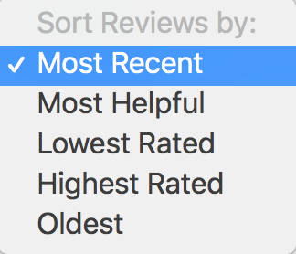

# Review Display

The goal of this challenge is to build a paired down version of a review display widget commonly found on merchant product display pages.

The widget will primarily fetch and render a list of reviews. It will also support client side sorting of reviews based on attributes, and helpul voting.

The starter project was bootstrapped with create-react-app, it includes a webservice that returns review data, as well as some helpful components.

## General Deliverables

This widget must be implemented using React. Feel free to add any other dependencies.

## Required functionality

### Review Listing

Use the data returned by the service to render a list of reviews similar to the attached mockup. Each review container should have a `data-id` attribute set to the `review_id` property.

View Mockup

### Sorting

Support client side sorting by

* Most Recent (default)
* Most Helpful (based on `helpful_score`)
* Lowest Rated
* Highest Rated
* Oldest

View Mockup

### Badging

Badges relay information about the review author. Badges should be prioritized in the following order:

* Staff Reviewer
* Verified Buyer
* Verified Reviewer

Badges icons can be found in `icons`.

### Helpful voting

Voting should be captured and confirmed on the client side. A user may only cast one vote per review. Votes do not need to persist through page reloads.

View Mockup

<video width="500" height="auto" autoplay>
  <source src="mockups/voting.mp4" type="video/mp4">
Your browser does not support the video tag.
</video>

## Extra Credit

These are not necessary but are relevant to the work done by the frontend team.

* Use a functional CSS framework like tachyons or tailwind
* Make the review listing responsive, (see mockups/review-display-mobile)
* Integration tests using cypress.io
