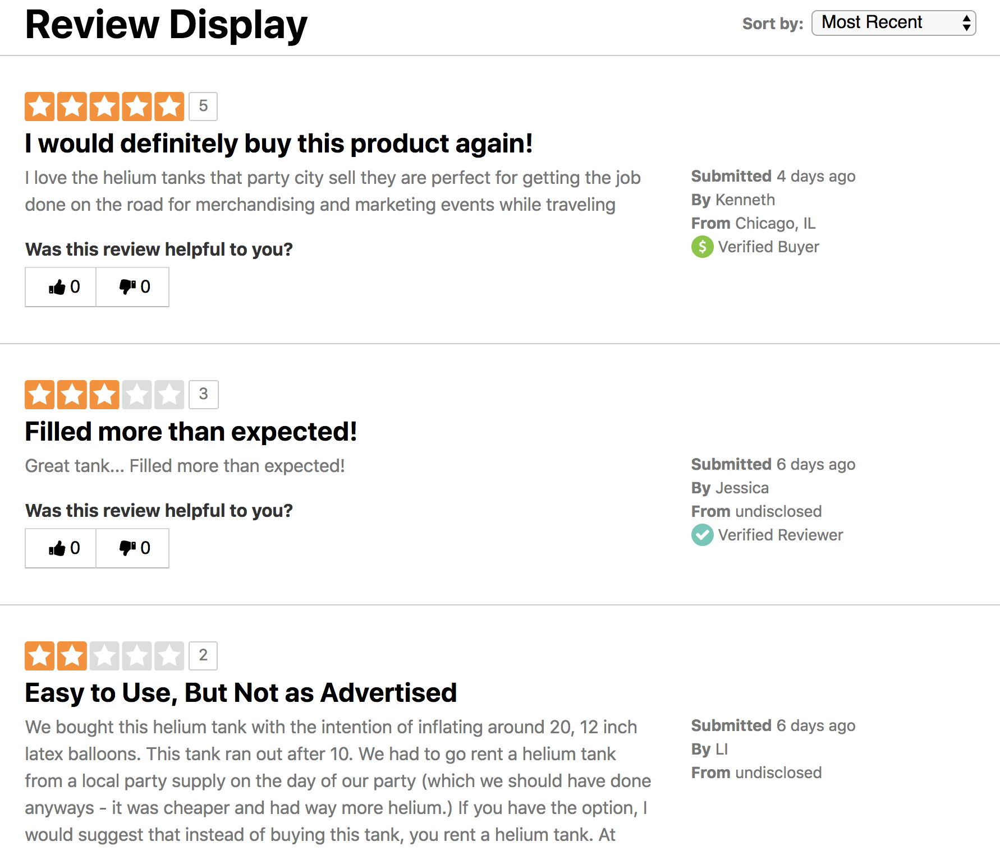
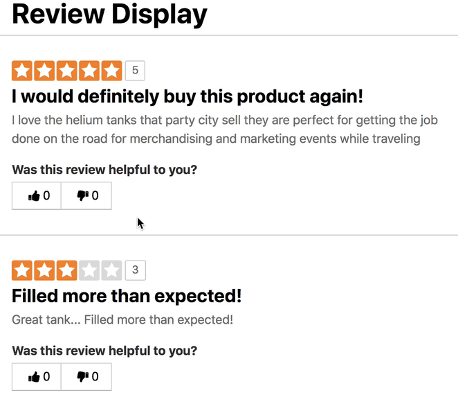

# Review Display

The goal of this excercise is to build a simple version of a review display widget commonly found on merchant product display pages.

The widget will primarily fetch and render a list of reviews. It will also support client side sorting of reviews based on attributes, and helpul voting. The widget must be implemented using [React](https://reactjs.org/), but you are free to use any other dependencies.

The starter project was bootstrapped with [create-react-app](https://github.com/facebook/create-react-app), it includes a webservice that returns review data, as well as some helpful components.

## Required functionality

### Review Listing

Use the data returned by the service to render a list of reviews similar to the attached mockup. Each review container should have a `data-id` attribute set to the `review_id` property.

View Mockup

### Sorting

Support client side sorting by

* Most Recent (default)
* Most Helpful (based on `helpful_score`)
* Lowest Rated
* Highest Rated
* Oldest

### Badging

Badges relay information about the review author. Badges should be prioritized in the following order:

* Staff Reviewer
* Verified Buyer
* Verified Reviewer

Badges icons can be found in [src/icons](src/icons).

### Helpful voting

Voting should be captured and confirmed on the client side. A user may only cast one vote per review. Votes do not need to persist through page reloads.

View Mockup

</video>

## Extra Credit

These are not necessary but are relevant to the work done by the frontend team.

* Use a functional CSS framework e.g. [tachyons](https://tachyons.io/) or [tailwind](https://tailwindcss.com/)
* Responsive review display, see:[mockups/review-display-mobile.png](mockups/review-display-mobile.png)
* Write Integration tests using [cypress.io](https://www.cypress.io/)
